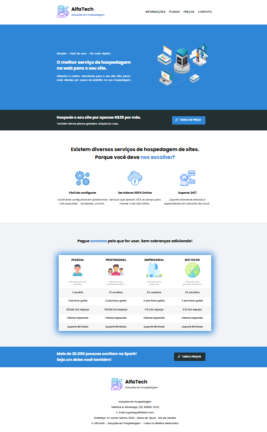

# 🌐 AlfaTech — Site de Hospedagem de Sites

Landing page moderna desenvolvida para uma empresa fictícia de hospedagem de sites.  
Este projeto foi criado no início dos meus estudos em front-end para praticar **HTML e CSS**, com foco em **layout profissional**.

---

## 🚀 Demonstração

🔗 [Acesse o site online](https://seudominio.com)
📸 *Veja abaixo uma prévia do design:*



---

## 💡 Sobre o projeto

O **AlfaTech** foi desenvolvido com o objetivo de simular o site de uma empresa de hospedagem de sites.  

Este projeto foi parte do meu processo de aprendizado em **HTML e CSS**, explorando boas práticas de estrutura.

---


## 🛠 Tecnologias utilizadas

- **HTML5** — Estrutura semântica do site  
- **CSS3** — Estilização
- **Google Fonts** — Tipografia personalizada    

---

## 💻 Como visualizar o projeto

```bash
# Clonar o repositório
git clone https://github.com/danieldmota/site-hospedagem.git

# Entrar na pasta
cd site-hospedagem

# Abrir o arquivo principal
Abra o arquivo index.html no seu navegador.
